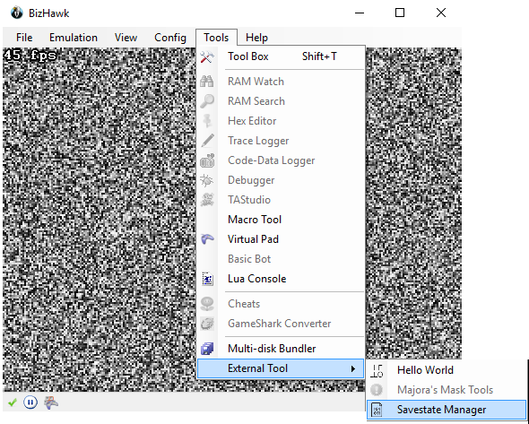
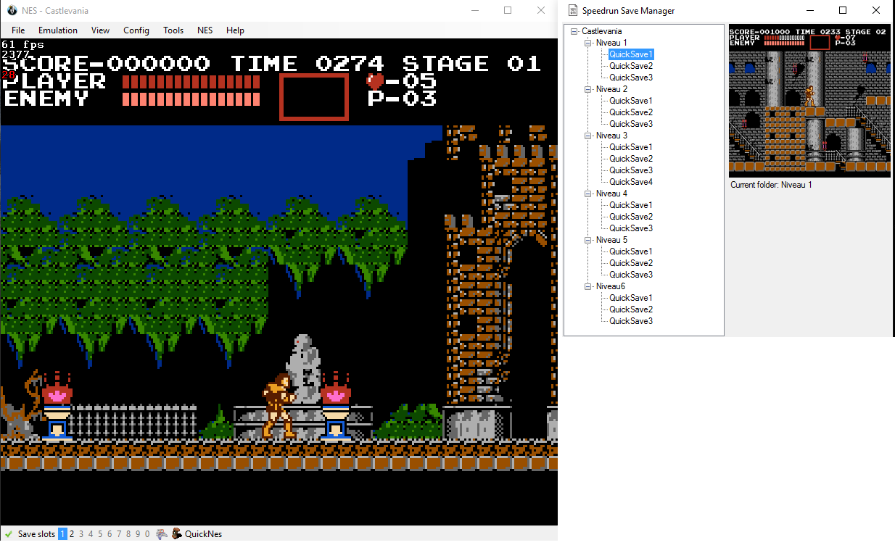

# SpeedrunSaveManager
A savestate manager for bizhawk

##Important notes

I had to add some new features into ApiHawk; they have been pushed to BizHawk official sources on the 29th of May and so, it will be included into the next official release.
Before that, we need an interim build in order to make this plugin works.

##Installation instructions

You can either use the version provided in the release (which is a developper build compiled few days ago) and replace your current version with it (**I strongly recommend to make a backup**)
or just add the .dll file into your ExternalTools directory if you already have a compatible version of BizHawk.

##How to use

* Once BizHawk is running, go to Tools => External Tools => Savestate Manager.

* Run whatever game you want.
* Use Quicksave/Quickload as you usually do (Default shortcut are [ctrl +] F1 -> F10)
* You'll notice that nodes will be added to the treeview
* You can add directory, subdirectories by rightclicking on the desired node in the treeview; you'll have up to 10 shortcut by folder
* Those Quicksave/Quickload are in fact relatives to the current folder (indicated above savestate preview)

*REM: All savestates are stored in BiZHawk/[System(NES/SNES/...)]/State/[Game] by default.
You can also have non-quicksave state; load them simply by clicking on their name in the treeview*

##Know issues

Sometimes, when the savestate preview is shown, you won't be able to override this savestate (and a message "Unable to save state ..." is show on BizHawk).
You can load another preview and wait a while, it should work (delete file manually also works).
I suppose that BizHawk keep something locked, have to figure out what and how to fix it.
